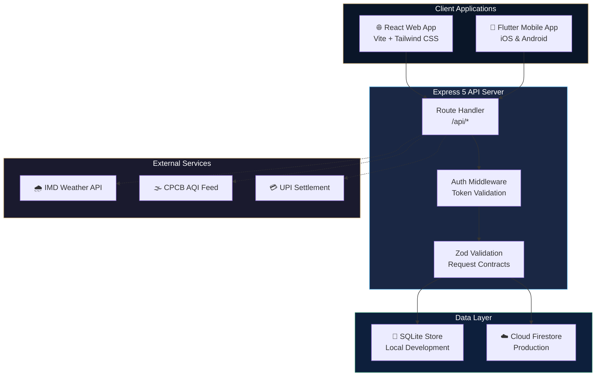
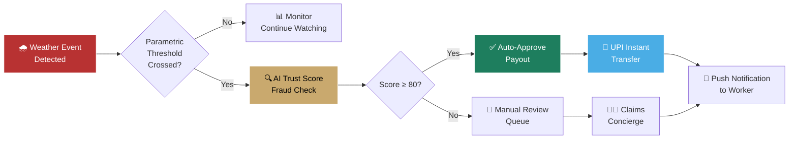
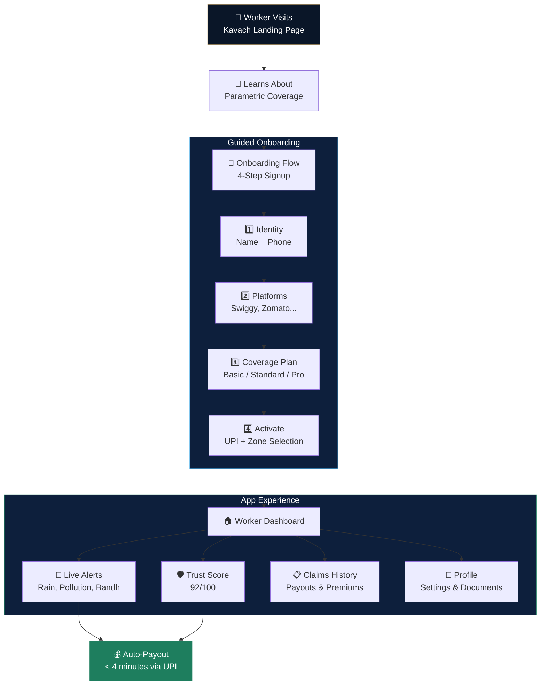
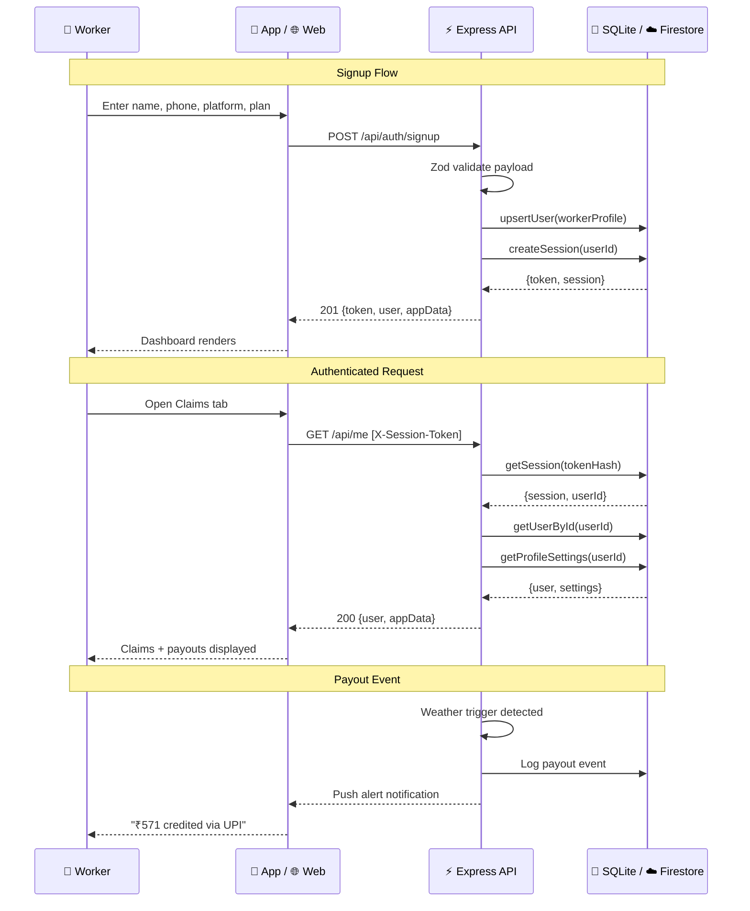

# Kavach


Parametric Income Protection for India's Gig Workers

Real-time weather, civic, and disruption triggers → instant UPI payouts

[Quick Start](#quick-start) • [Architecture](#architecture) • [Mobile App](#flutter-mobile-app) • [Deployment](#deployment) • [API](#api-reference)

---

## What is Kavach?

Gig delivery workers on platforms like **Swiggy, Zomato, Blinkit, and Amazon Flex** lose income to rain, flooding, pollution spikes, curfews, and civic disruptions — but traditional insurance is too slow, too generic, or too complicated to help in the moment.

**Kavach** is a parametric micro-insurance platform that automatically detects disruption events and pays workers within minutes via UPI. No claim forms. No waiting. No jargon.

### Key Features

| Feature | Description |
| ------- | ----------- |
| **7 Trigger Categories** | Heavy rain, floods, curfews, bandhs, extreme heat, pollution, fog |
| **AI Trust Scoring** | Behavioral analytics prevent fraud while fast-tracking honest claims |
| **< 4 Min Payouts** | Auto-approved payouts land directly in worker UPI handles |
| **₹29–79/week Plans** | Basic, Standard, and Pro tiers covering ₹2,500–₹6,500 weekly income |
| **Multi-Platform** | Web dashboard + Flutter cross-platform mobile app (iOS & Android) |
| **Admin Analytics** | Premiums, claims, fraud signals, loss ratios, and financial health dashboards |

---

## Architecture

```text
kavach/
├── src/                    # React 18 web frontend (Vite + Tailwind CSS)
├── server/                 # Express 5 API server (TypeScript)
│   ├── app.ts              # Route definitions & middleware
│   ├── store.ts            # SQLite store (local development)
│   ├── firestore-store.ts  # Cloud Firestore store (production)
│   ├── seed.ts             # Demo data & user factory
│   └── types.ts            # Server-side type definitions
├── flutter_kavach/         # Flutter mobile app (iOS + Android)
│   └── lib/
│       ├── main.dart       # App entry point
│       ├── screens/        # Dashboard, Claims, Alerts, Profile
│       ├── models/         # Data models
│       ├── providers/      # State management (Provider)
│       ├── services/       # API client
│       └── theme/          # Digital Guardian design system
├── packages/shared/        # Shared API contracts & domain types
├── tests/                  # Web & server test suites
├── Dockerfile              # Multi-stage Cloud Run container
└── .github/                # CI/CD workflows
```

### Tech Stack

| Layer | Technology |
| ----- | ---------- |
| **Web Frontend** | React 18, TypeScript, Vite, Tailwind CSS, Framer Motion, Recharts, React Router 6 |
| **Mobile App** | Flutter 3, Dart, Provider, Material Design 3 |
| **API Server** | Express 5, TypeScript, Zod validation |
| **Database** | SQLite (local dev) / Google Cloud Firestore (production) |
| **Auth** | Token-based sessions with SHA-256 hashing, 30-day TTL |
| **Deployment** | Docker, Google Cloud Run |
| **CI/CD** | GitHub Actions |

### System Architecture Diagram



### Parametric Payout Flow



### User Journey Flowchart



### Auth & Data Flow



---

## Quick Start

### Prerequisites

- **Node.js** ≥ 22
- **npm** ≥ 10
- **Flutter** ≥ 3.x (for mobile development)

### Web + API (Development)

```bash
# Clone the repository
git clone https://github.com/Aadishah17/kavach.git
cd kavach

# Install dependencies
npm install

# Start dev server (web + API concurrently)
npm run dev
```

The web app runs at `http://localhost:5173` and the API at `http://localhost:8787`.

### Available Scripts

| Script | Description |
| ------ | ----------- |
| `npm run dev` | Start web + API dev servers concurrently |
| `npm run dev:client` | Vite dev server only |
| `npm run dev:server` | Express API with hot reload (tsx watch) |
| `npm run build` | Production build (client + server) |
| `npm run test` | Run all tests (server + web) |
| `npm run test:server` | Server unit tests |
| `npm run test:web` | Web integration tests (Vitest) |
| `npm run lint` | ESLint check |
| `npm run demo:reset` | Reset demo user data |

---

## Flutter Mobile App

The Flutter companion app lives in `flutter_kavach/` and provides a native cross-platform experience for iOS and Android.

### Screens

- **Dashboard** — Trust score, insured weekly income, active alerts
- **Claims** — Payout history with AI Guardian verification signals
- **Alerts** — Live guardian status, chronological notification feed, emergency resources
- **Profile** — Linked documents, settings (smart alerts, biometric lock, language), sign out

### Design System: "Digital Guardian"

- **Palette:** Navy (#0A1628), Gold (#C9A96E), Sky Blue (#4AADE5), semantic greens/reds
- **Typography:** Manrope (headings) + Inter (body)
- **Principles:** Tonal depth over dividers, glassmorphism, ambient elevation, no hard borders

### Running the Flutter App

```bash
cd flutter_kavach

# Get dependencies
flutter pub get

# Run on connected device or emulator
flutter run

# Run on specific platform
flutter run -d chrome     # Web
flutter run -d ios        # iOS Simulator
flutter run -d android    # Android Emulator
```

### Flutter Project Structure

```text
flutter_kavach/lib/
├── main.dart              # App entry, Provider setup, theme
├── models/
│   └── app_data.dart      # Data models (AppData, Alert, Claim)
├── providers/
│   └── app_provider.dart  # State management via ChangeNotifier
├── services/
│   └── api_service.dart   # HTTP client for Kavach API
├── screens/
│   ├── main_layout.dart   # Bottom nav shell (4 tabs)
│   ├── dashboard_screen.dart
│   ├── claims_screen.dart
│   ├── alerts_screen.dart
│   └── profile_screen.dart
└── theme/
    └── app_theme.dart     # Digital Guardian theme tokens
```

---

## Deployment

### Cloud Run (Production)

Kavach is containerized for Google Cloud Run with automatic Firestore backend switching.

```bash
# Build the Docker image
docker build -t kavach-app .

# Run locally with Firestore
docker run -p 8080:8080 \
  -e USE_FIRESTORE=true \
  -e GOOGLE_APPLICATION_CREDENTIALS=/path/to/sa-key.json \
  kavach-app

# Deploy to Cloud Run
gcloud run deploy kavach-app \
  --source . \
  --region asia-south1 \
  --allow-unauthenticated \
  --set-env-vars USE_FIRESTORE=true
```

### Environment Variables

| Variable | Default | Description |
| -------- | ------- | ----------- |
| `PORT` | `8787` (dev) / `8080` (Docker) | Server port |
| `USE_FIRESTORE` | `false` | Use Cloud Firestore instead of SQLite |
| `NODE_ENV` | `development` | Set to `production` in deployed environments |

### Firestore Collections

When `USE_FIRESTORE=true`, data is stored in three collections:

| Collection | Key | Purpose |
| ---------- | --- | ------- |
| `users` | Document ID = `user.id` | Worker profiles, KYC, plan info |
| `sessions` | Document ID = `session.id` | Auth sessions with token hashing |
| `profileSettings` | Document ID = `userId` | Per-user notification & app preferences |

---

## API Reference

All API routes are prefixed with `/api`. Authentication uses the `X-Session-Token` header.

### Public Routes

| Method | Endpoint | Description |
| ------ | -------- | ----------- |
| `GET` | `/api/health` | Health check |
| `POST` | `/api/auth/demo-login` | Login as demo user |
| `POST` | `/api/auth/signup` | Create new worker account |
| `GET` | `/api/static` | Static app content (landing, triggers, pricing) |

### Authenticated Routes

| Method | Endpoint | Description |
| ------ | -------- | ----------- |
| `GET` | `/api/me` | Current user profile + app data |
| `POST` | `/api/auth/logout` | Revoke current session |
| `GET` | `/api/profile/settings` | Get profile settings |
| `PATCH` | `/api/profile/settings` | Update profile settings |

### Admin Routes (role: `admin`)

| Method | Endpoint                | Description                |
| ------ | ----------------------- | -------------------------- |
| `GET`  | `/api/admin/analytics`  | Platform analytics & KPIs  |

---

## Testing

```bash
# Run all tests
npm run test

# Server tests only
npm run test:server

# Web integration tests (Vitest + JSDOM)
npm run test:web

# Flutter analysis
cd flutter_kavach && flutter analyze
```

---

## Design Philosophy

Kavach follows a strict design system called **"Digital Guardian"** across all surfaces:

1. **Trust Through Design** — Navy-dominant palette signals reliability; gold accents mark protected states
2. **No Dividers Rule** — Tonal depth and ambient shadows create visual hierarchy without hard lines
3. **Progressive Disclosure** — Workers see what matters now; admin views layer depth on demand
4. **Parametric Clarity** — Every trigger, payout, and coverage state is visually unambiguous
5. **Mobile-First** — Core flows are designed for one-handed phone usage during work shifts

---

## Roadmap

- [ ] Integrate live IMD weather, CPCB AQI, and mobility feeds for real-time triggers
- [ ] Production-grade auth (OTP via SMS, Aadhaar eKYC)
- [ ] UPI payout orchestration via settlement rails
- [ ] Multilingual support (Hindi, Kannada, Tamil, Telugu)
- [ ] Push notifications for Flutter app (FCM)
- [ ] Offline-ready mobile workflows with sync queue
- [ ] City-specific rollout logic and zone management
- [ ] Premium analytics dashboard with exportable reports

---

## License

This project was built for educational and demonstration purposes.

---

Built for India's 15M+ gig workers
